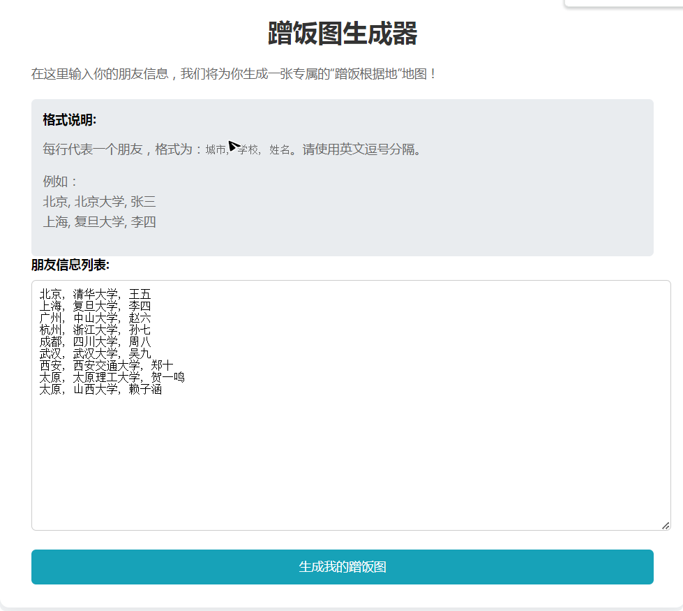
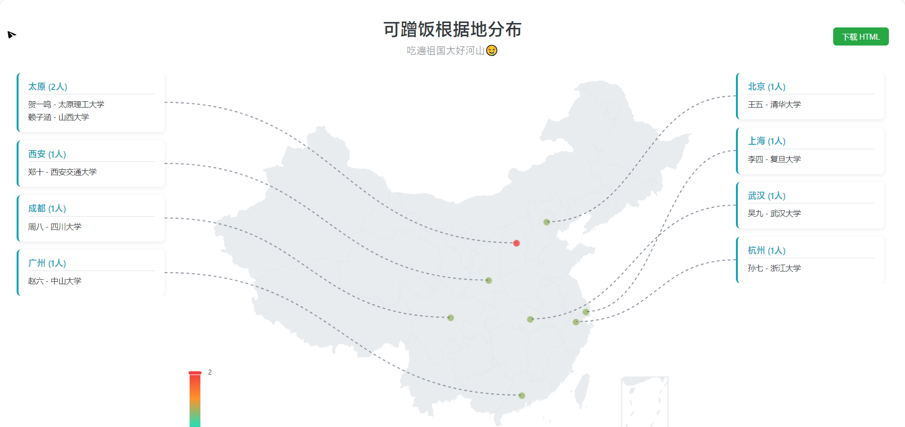

# AluminEats-Map - 大学去向可视化地图生成工具

## 项目简介

AluminEats-Map 是一个用于展示学生大学去向的可视化工具，能够自动生成交互式地图页面，直观地展示学生们的大学录取情况。项目包含：

- 基于 `Cloudflare Workers` 部署的在线服务（`index.js`）
- 本地运行生成静态 HTML 文件的脚本（`gen5.py`）
- 用于生成中国城市经纬度数据的脚本（`gen_city.py`）

## 项目展示

### Cloudflare Workers页面



## 项目结构

```
UniMap/
├── index.js          # Cloudflare Workers 部署脚本
├── gen5.py           # 本地生成静态 HTML 页面脚本
├── gen_city.py       # 生成中国城市经纬度数据脚本
```

## 使用方法

### 1. Cloudflare Workers 部署（在线版）

- 注册并登录 [Cloudflare Workers](https://workers.cloudflare.com/)
- 创建新的 Worker 服务，将 `index.js` 中的代码复制到 Cloudflare Workers 编辑器中
- 根据需求修改数据源和配置，保存并部署即可在线访问

### 2. 本地生成静态 HTML 页面

- 运行脚本生成 HTML：
```bash
python gen5.py
```

- 生成的 HTML 文件为`graduates_map_final_v2.html`, 位于项目根目录，直接用浏览器打开即可查看效果。

### 3. 生成城市经纬度数据

- 运行脚本：
```bash
python gen_city.py
```

- 生成的经纬度数据文件为 `china_city_coords.json`，可供自己上传/使用。

## 数据格式说明
### Cloudflare Workers部署的数据
如页面提示所示，`城市, 学校, 姓名`作为每一行即可。
例如：
北京, 北京大学, 张三  
上海, 复旦大学, 李四

### gen5.py中的数据
- 学生录取数据建议使用 CSV 或 JSON 格式，示例如下：

```json
{
                "city_name": "北京",
                "students": [
                    {
                        "name": "李宇航",
                        "university": "北京大学"
                    },
                    {
                        "name": "王梓睿",
                        "university": "清华大学"
                    },
                    {
                        "name": "张欣怡",
                        "university": "中国人民大学"
                    },
                    {
                        "name": "刘文轩",
                        "university": "北京师范大学"
                    },
                    {
                        "name": "陈俊杰",
                        "university": "北京航空航天大学"
                    },
                    {
                        "name": "杨一诺",
                        "university": "北京理工大学"
                    },
                    {
                        "name": "赵思睿",
                        "university": "中国农业大学"
                    },
                    {
                        "name": "黄皓宇",
                        "university": "中央财经大学"
                    },
                    {
                        "name": "周佳琪",
                        "university": "对外经济贸易大学"
                    },
                    {
                        "name": "吴雨泽",
                        "university": "中国政法大学"
                    }
                ]
            },
```

## 技术栈

- Cloudflare Workers
- Python
- HTML/CSS/JavaScript
- 地图可视化库（如 ECharts、Leaflet 等）

## 贡献指南

欢迎提交 Issue 或 Pull Request 来帮助改进本项目。

## 许可证

本项目采用 MIT 许可证开源。
